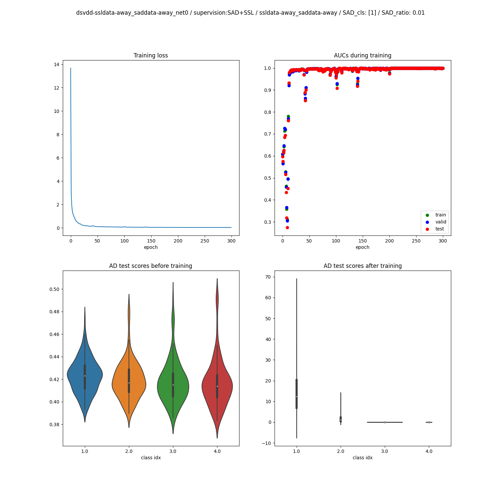
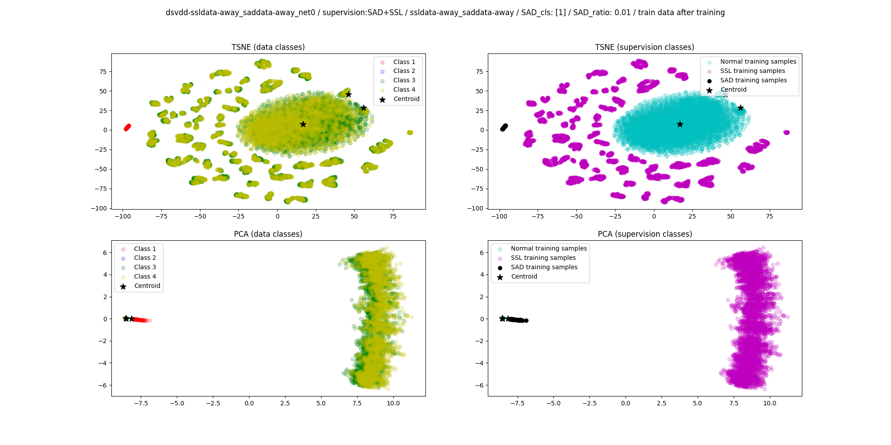
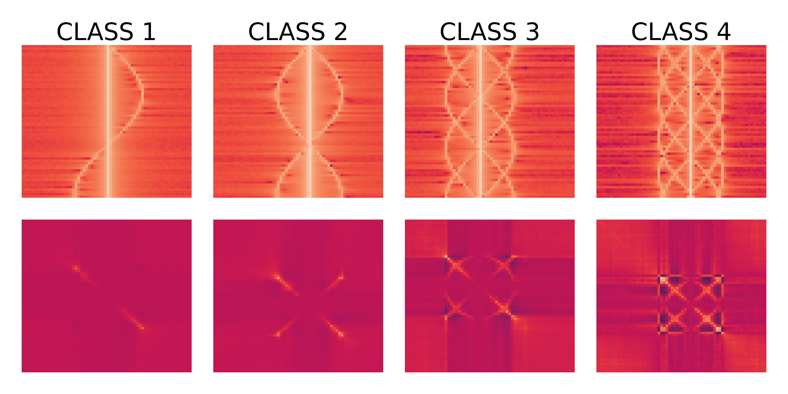
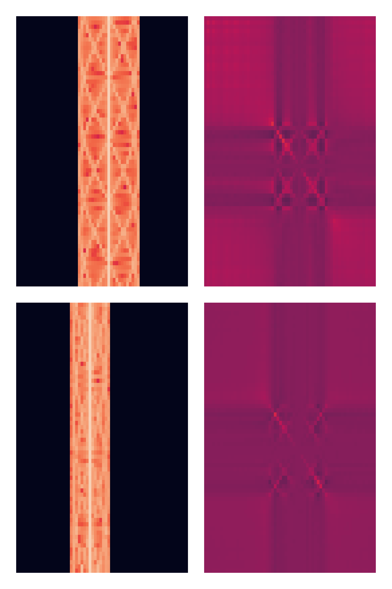

## Table of contents
* [General description](#general-description)
* [Code organisation](#code-organisation)
* [How to launch an experiment](#how-to-launch-an-experiment)
* [How to find and read the results of an experiment](#how-to-find-and-read-the-results-of-an-experiment)
* [Micro-Doppler dataset](#micro-doppler-dataset)
* [Potential follow-ups to the paper experiments](#potential-follow-ups-to-the-paper-experiments)
* [Requirements](#requirements)
* [License](#license)

### General description

This is the github repository for the preprint ADD URL currently under review for publication. The paper presents AD experiments on simulated micro-Doppler radar
signatures of helicopter-like targets. This code enables you to launch similar experiments
to the ones presented in the paper, and more generally to achieve unsupervised and semi-supervised AD (as defined in Lukas Ruff [paper](https://arxiv.org/abs/1906.02694)) experiments
with deep and non-deep approaches.

If you found this code useful, please consider citing the paper:

ADD PAPER REFERENCE

### Code organisation

- `utils.py` and `training.py` contain various functions used for loading data and in the main model training scripts `deep_svdd.py`, `deep_msvdd.py`, `deep_rpo.py`, `shallow_pca.py`
and `shallow_tpca.py`.

- `networks.py` contain several neural networks architectures considered for our paper, only one ("net0") was kept to produce the paper results. The latter led the best results during
preliminary comparisons.

- The AD approached themselves are coded in `deep_XXX.py` and `shallow_XXX.py` scripts, which receive experiments hyperparameters from the `launchers_XXX.py` 
scripts and run experiments accordingly for the number of random seeds chosen.

- `data/` directory in which to put the data files you can download [here](https://cloud.mbauw.eu/s/BPtk5HYkyBWAGLo).
This data was generated using a simple MATLAB simulation code that can be found on this other repository. You can easily modify
this simulation code to generate a similar dataset with more classes, or increase the intraclass diversity. The data files you should download
are loaded and preprocessed using the `simulated_radar_dataset` in `utils.py`.

### How to launch an experiment

- A simple example launch script is proposed in `launch_example.py`, the experiments of the published paper can be reproduced using the `launcher_paper_XXX.py` scripts.

- Launchers are divided into several scripts in order to ease the distribution of computations over several GPUs and computing instances. Shallow
baselines should be computed on a CPU machine with numerous cores, the shallow AD methods being CPU-bound. 

- Executing `launcher_paper_deep_experiments.py` takes a little more than two days on a P100 GPU, but one could easily divide this launcher into two or more
launcher scripts (for example start the bimodal normality experiments in a dedicated script) to train everything faster in several independent cluster jobs. This is 
made easy by the storage of results in a `.csv` file for every launch script: one only needs to gather the lines of all `.csv` files created by the different jobs
in a new `.csv` file to read all results at once using the dedicated jupyter notebook (see explanations below).

### How to find and read the results of an experiment

The results of every experiment (one experiment being one method trained on any number of seeds) are available in the `results/` directory. This repository
already includes
the results directory of the experiments launched using `launcher_example.py`. Inside `results/`, 
experiments results are organized according to the input
data format, the AD method used and the launch time. 

The figures generated for each seed of a deep AD experiment include training metrics (loss, AUCs, AD score distribution, see example below) and 2D projections of the data points
before and after training with PCA and tSNE (2D latent representations are available for Deep SVDD and Deep RPO adaptations). The example results directories do not contain the `.pt` files with the untrained and trained model
weights to avoid putting large files on github, but will be generated if you launch experiments on your machine. The performances of experiments for 
every seed are stored in a `.csv` in `comparison_graphs/` and in the results folders inside `results/`. In `comparison_graphs/`, a jupyter notebook is
available to read the `.csv` created by experiments, and enables the easy computation of the mean performances when methods run on several seeds.

The title of a group of figures indicates various information about the experiment setup: type of loss, SAD ratio (how many SAD labelled anomalies are 
available during training), etc. Several centroids (black stars) can be seen on latent 2D representations because the current version of the code plots 
the normal samples centroid, the SSL samples centroid, and the SAD samples centroid as soon as the required samples are available in the training set (i.e. 
even when the samples are not concentrated around their dedicated centroid during training).

### Micro-Doppler dataset

This micro-Doppler signatures dataset was generated thanks to a MATLAB simulation, the code of which can be found
in this other repo (??? ADD URL). Four classes are used to create normal and anomalous modes, each class being defined
by a helicopter-like target with a specific number of rotating blades, the latter being responsible for specific spectrum
modulation patterns.

*Inter-class diversity:* the number of blades changes across classes, changing the modulation pattern

*Intra-class diversity:* diversity example with preprocessed samples from class four, the one with the most blades, i.e. with the most complex modulation pattern.
One can notice the varying modulation width, stemming from different values of blade length & RPMs, as well as the varying
central Doppler shift. The lateral background is set to zero in order to make the neural network input format closer to MNIST and Fashion-MNIST
samples, since our network architecture is inspired by this [paper](https://arxiv.org/abs/1906.02694). The idea of creating MNIST-like benchmarks has been of 
interest in different scientific communities such as [biomedical images](https://arxiv.org/pdf/2010.14925.pdf) 
and [3D modeling](https://proceedings.neurips.cc/paper/2016/file/1d94108e907bb8311d8802b48fd54b4a-Paper.pdf).

### Potential follow-ups to the paper experiments

Easy follow-ups to our experiments include:
- conducting the same experiments on a similar dataset where samples have a lower Doppler resolution, e.g. use 32 Doppler bins instead of 64 (which is a relevant radar experiment, since some
pulse Doppler radars have few pulses to characterize targets, cf. our paper ADD URL);
- conducting the same experiments on a similar dataset where samples have higher intra-class diversity, which could be generated thanks to a stronger
noise in the samples generating process as well as wider uniform distributions from which to pick the targets parameters like the blade size or blades
RPMs;
- adding one or more AD methods to the comparison proposed in our paper (such as AD using an auto-encoder, where the reconstruction error serves as the AD score, as was
already done here ADD URL or here ADD URL).

### Requirements

Create a virtual environment and use the following pip command, it 
+should at least work with Python 3.7 and 3.8:

`pip3 install seaborn scikit-learn numpy geomstats tqdm matplotlib scipy pandas torch torchvision torchaudio --extra-index-url https://download.pytorch.org/whl/cu113`

### License

MIT